# 书生浦语言大模型实战--第一课

## 前言

大模型是发展成为人工智能的重要途径，随着chatgpt的发布，大家对大模型的关注度也越来越高。书生浦语全链条开源开放体系包括了从模型到应用全过程需要用到的工具，包括：数据，预训练，微调，评测，部署，智能体构建。

模型的分类：

- 专用模型：针对特定任务，一个模型解决一个问题
- 通用大模型：一个模型应对多种任务，多种模态

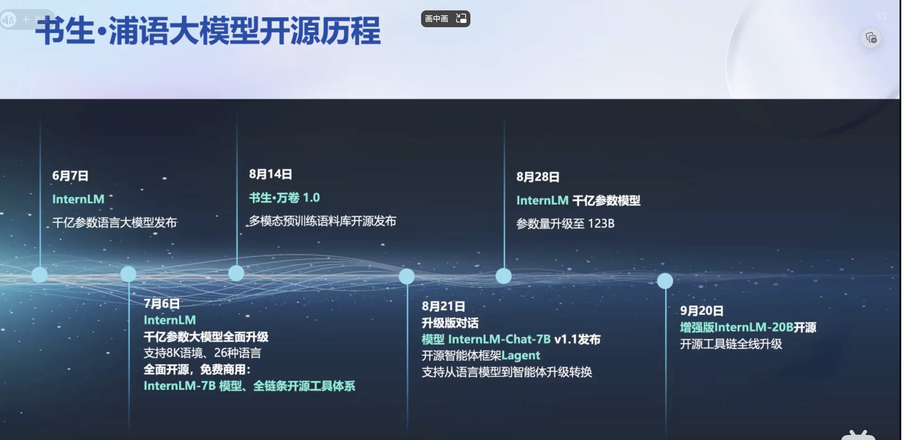

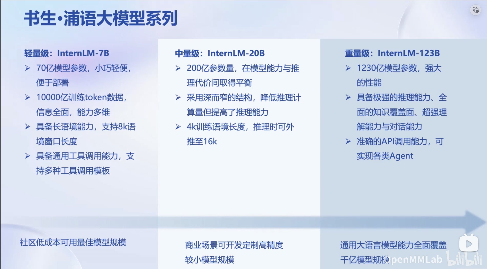

## 模型选型

从模型到应用仍然有很大距离，需要使用框架和工具让协作模型构建应用

- 如果应用场景是简单的对话，可以直接把模型拿过来通过prompt-engineering进行使用
- 场景复杂，则需要通过微调。根据算力大小，可以选择全参微调和部分参数（使用lora之类的算法把大部分参数固定，微调小部分参数）的微调

模型如果需要调用外部api、和业务数据进行交互，可以构建为智能体。微调好的模型在接入业务前需要评测，通过评测再进行部署

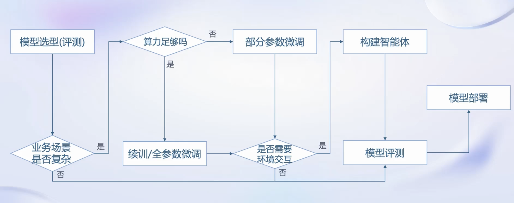

书生浦语全链条开源开放体系包括了从模型到应用全过程需要用到的工具

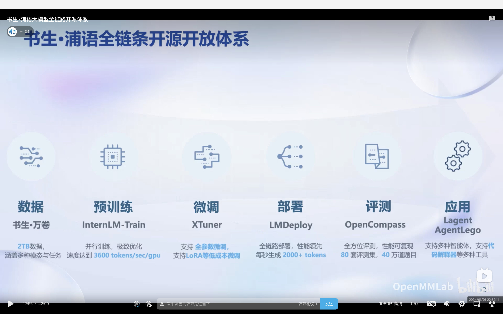

## 数据

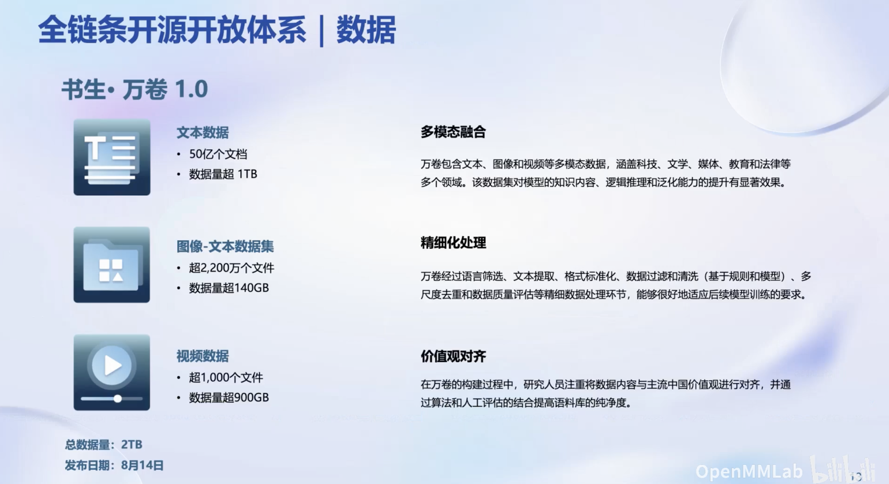

## 预训练

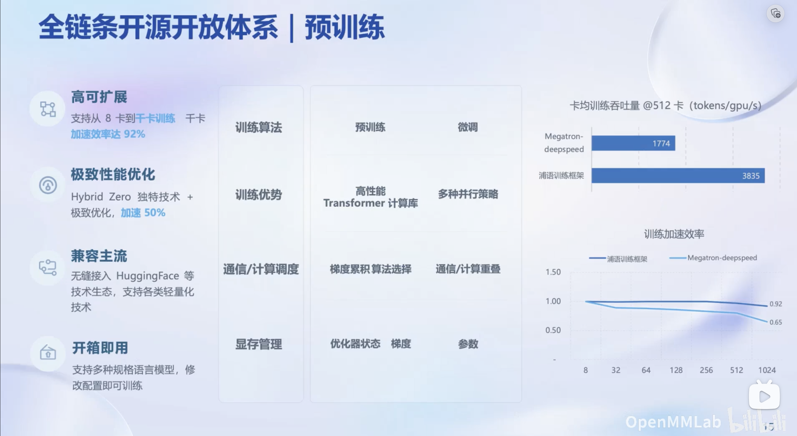

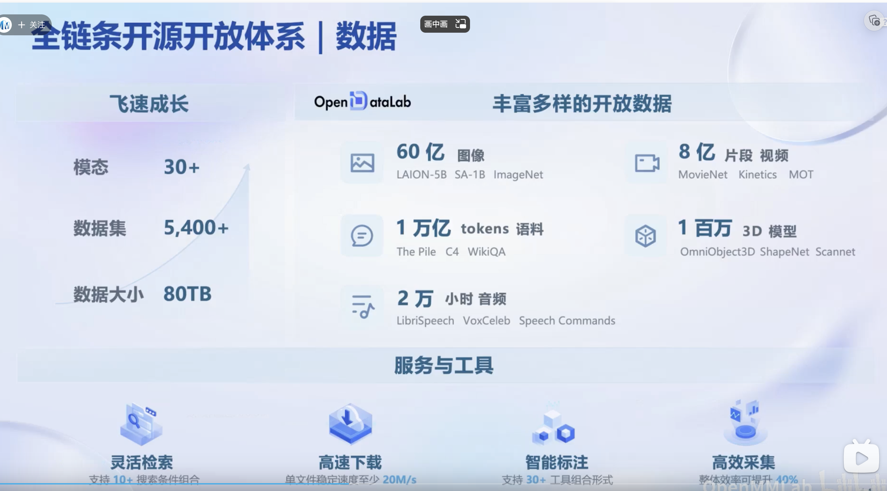

## 微调

大语言模型的下游应用中，增量续训和有监督微调是经常会用到两种方式

- 增量续训。使用场景:让基座模型学习到一些新知识，如某个垂类领域知识。训练数据:文章、书籍、代码等
- 有监督微调。让模型学会理解和遵循各种指令，或者注入少量领域知识训练数据:高质量的对话、问答数据。数据量相较于预训练和增量续训更小

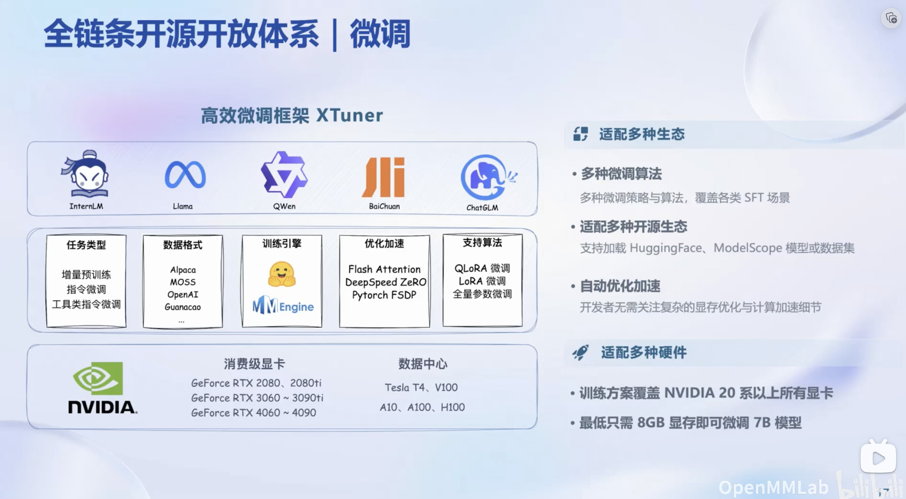

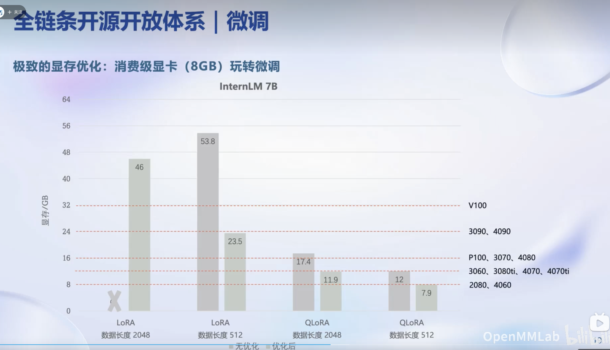

## 评测

openCompass评测工具，提供了全面的评测体系

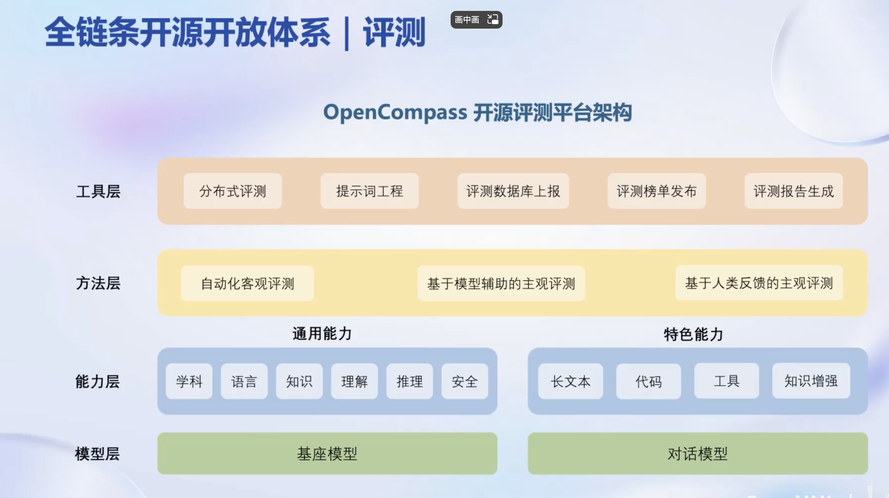

## 部署

大模型的特点：

- 内存开销巨大。庞大的参数量采用自回归生成token，需要缓存k/v。
- 动态Shape。请求数不固定令牌逐个生成，且数量不定
- 模型结构相对简单。transformer结构，大部分是decoder-only

部署的技术挑战：

- 技术挑战。设备低存储设备(消费级显卡、移动端等)如何部署?
- 推理。如何加速 token 的生成速度，如何解决动态shape，让推理可以不间断，如何有效管理和利用内存
- 服务。提升系统整体吞吐量，降低请求的平均响应时间

部署上的技术点：

- 模型并行
- 低比特量化
- 注意力优化
- 计算和访存优化连续配料

LmDeploy，支持上述技术点方向的部署，提供python，gRPC，restful接口，并且在推理性能上遥遥领先。

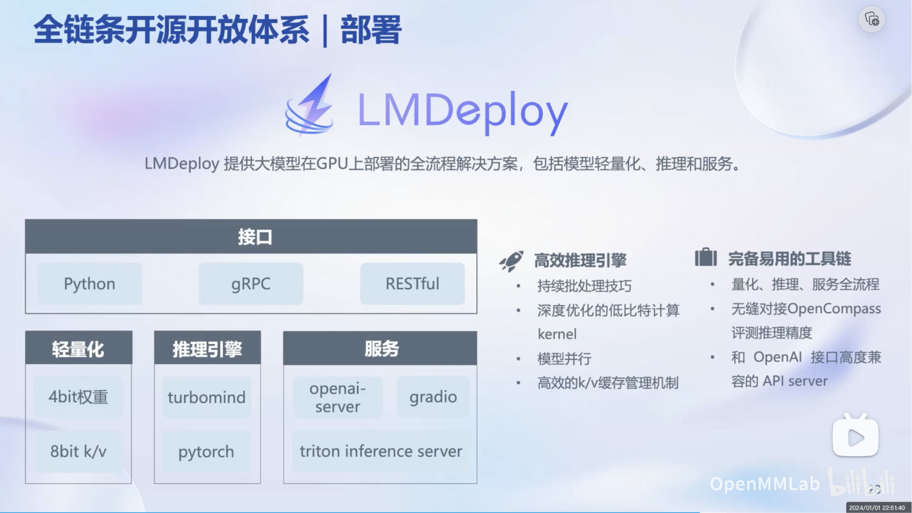

## 智能体

Lagent，主要用于搭建智能体框架。支持ReAct,ReWoo,AutoGPT智能体类型的实现，支持多种大语言模型，易于拓展支持丰富的工具。大模型并非万能的，如果需要让模型执行复杂的任务，或者需要与业务数据交互，可以构建智能体，借助智能体调用三方工具提升模型能力。

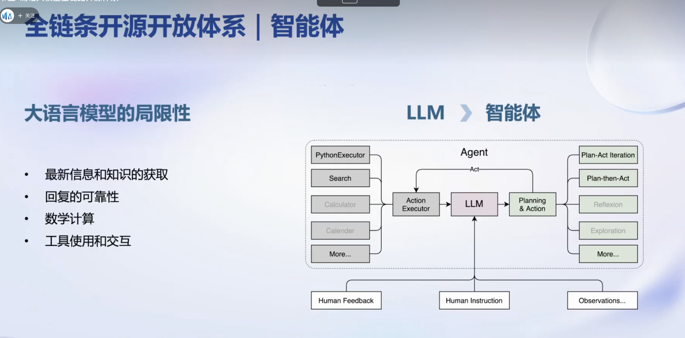

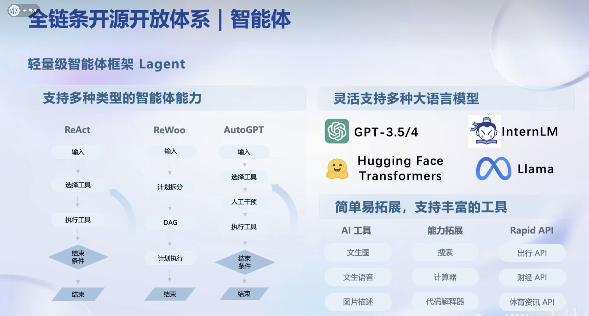

AgentLego，是一个多模态智能体工具箱 ，主要用途是给模型提供第三方工具，提升模型在特定方向的能力，它有着的丰富的工具集合，尤其是提供了大量视觉、多模态相关领域的前沿算法功能支持多个主流智能体系统，如 LangChain，Transformers Agent，Lagent 等灵活的多模态工具调用接口，可以轻松支持各类输入输出格式的工具函数支持一键式远程工具部署，轻松使用和调试大模型智能体。

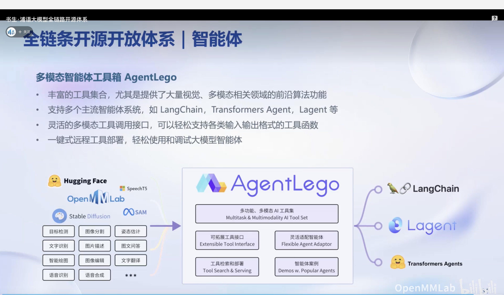