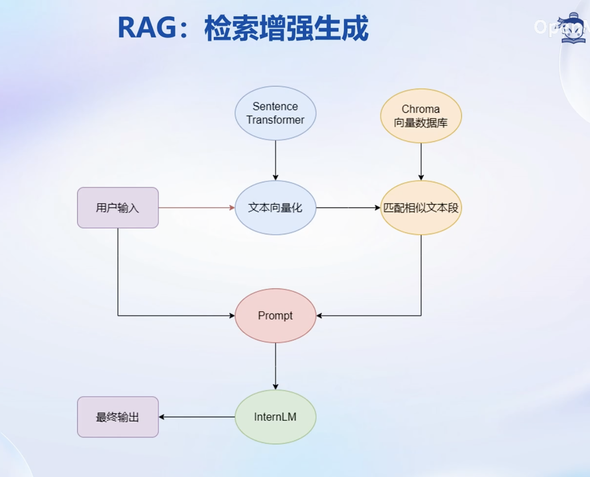
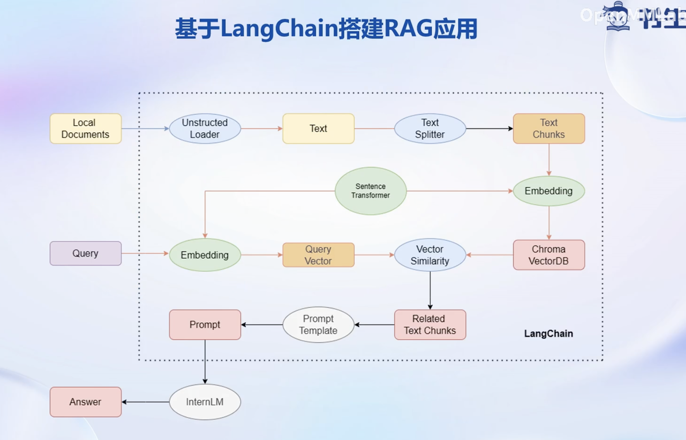

# 书生浦语大模型实战营--第三课

## 大模型开发范式

LLM 的局限性

- 知识时效性受限:如何让LLM能够获取最新的知识

- 专业能力有限:如何打造垂域大模型

- 定制化成本高:如何打造个人专属的LLM应用

### RAG VS Finetune

RAG：检索增强生成，通过给大模型外挂数据库提升模型在特定领域的知识。

RAG特点：

- 可实时更新

- 受基座模型影响大

- 单次回答知识有限

Finetune：在一个新的较小的数据集上进行轻量级的训练微调从而提高模型在新数据集上的能力

特点：

- 可个性化微调

- 知识覆盖面广

- 成本高昂

- 无法实时更新

## LangChain 简介

LangChain 框架是一个开源工具，通过为各种 LLM 提供通用接口来简化应用程序的开发流程，帮助开发者自由构建 LLM应用。

LangChain 的核心组成模块:

- 链(Chains):将组件组合实现端到端应用，通过一个对象封装实现一系列LLM 操作
- E9检索问答链，覆盖实现了 RAG(检索增强生成)的全部流程
 

## 构建向量数据库

1. 确定源文件类型，针对不同类型源文件选用不同的加载器
    - 核心在于将带格式文本转化为无格式字符串

2. 由于单个文档往往超过模型上下文上限，我们需要对加载的文档进行切分
    - 一般按字符串长度进行分割
    - 可以手动控制分割块的长度和重鲁区间长度

3. 使用向量数据库来支持语义检索，需要将文档向量化存入向量数据库
    - 可以使用任--种 Embedding 模型来进行向量化
    - 可以使用多种支持语义检索的向量数据库，一般使用轻量级的 Chroma

### 搭建知识库助手

RAG方案优化建议

基于RAG的问答系统性能核心受限于，检索精度， Prompt性能。一些可能的优化点:

检索方面：基于语义进行分割，保证每一个chunk的语义完整，给每一个chunk生成概括性索引，检索时匹配索引。

Prompt方面： 迭代优化Prompt策略。