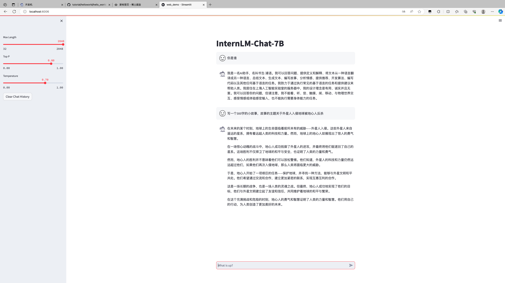

# 基础作业

## 使用 InternLM-Chat-7B 模型生成 300 字的小故事（需截图）。

## 熟悉 hugging face 下载功能，使用 huggingface_hub python 包，下载 InternLM-20B 的 config.json 文件到本地（需截图下载过程）。

# 进阶作业（可选做）
开发机没算力了，所以没做
## 完成浦语·灵笔的图文理解及创作部署（需截图）
## 完成 Lagent 工具调用 Demo 创作部署（需截图）